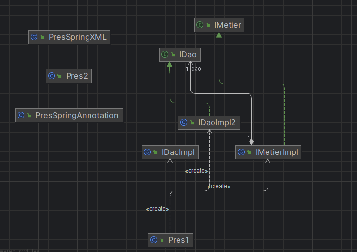
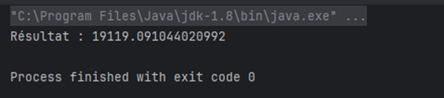
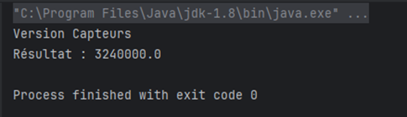
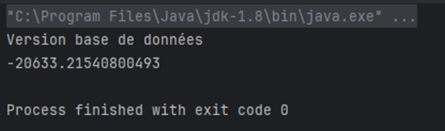
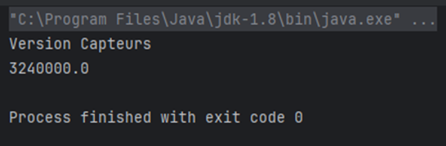
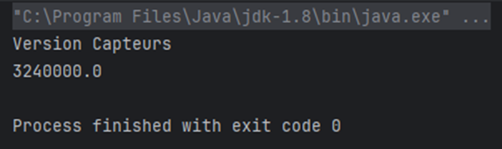
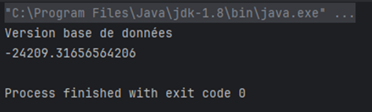
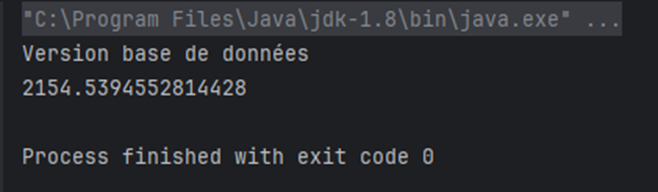

<h1>Projet d'Inversion de contrôle et Injection des dépendances</h1>

<h2>Introduction :</h2>

    L'inversion de contrôle, souvent abrégée en IoC, est un principe de conception qui renverse le contrôle de l'exécution d'une application. Au lieu que les composants de l'application appellent directement les dépendances dont ils ont besoin, ces dépendances sont fournies par un conteneur IoC.

    L'injection de dépendances (DI) est une technique permettant de fournir les dépendances requises par un composant sans que celui-ci les construise explicitement. 

<h2>Enoncé :</h2>

1. Créer l'interface IDao avec une méthode getDate

2. Créer une implémentation de cette interface 

3. Créer l'interface IMetier avec une méthode calcul

4. Créer une implémentation de cette interface en utilisant le couplage faible

5. Faire l'injection des dépendances :

   a. Par instanciation statique

    b. Par instanciation dynamique 
    
    c. En utilisant le Framework Spring
     - Version XML
     - Version annotations

<h2>Conception :</h2>

<h2>Partie 1 :</h2>
<h3>1/- L’interface IDao : </h3>

    
    package dao;

    public interface IDao {
        double getData();
    }

<h3>2/- Implémentation : </h3>

    
    package dao;

    public class IDaoImpl implements IDao {
        @Override
        public double getData() {
            return Math.random()*40;
        }
    }

<h3>3/- L’interface IMetier :</h3>

    
    package metier;

    public interface IMetier {
        double calcul();
    }

<h3>4/-  L’implémentation de cette interface en utilisant le couplage faible :</h3>

    
    package metier;
    
    import dao.IDao;
    
    public class IMetierImpl implements IMetier {
        private IDao dao;
        @Override
        public double calcul() {
            double tmp = dao.getData();
            double res = tmp*540/Math.cos(tmp*Math.PI);
            return res;
        }
    
        public void setDao(IDao dao) {
            this.dao = dao;
        }
    } 

<h3>5/- l'injection des dépendances :</h3>
<h4>a.	Par instanciation statique :</h4>

    
    package presentation;
    
    import dao.IDaoImpl;
    import ext.IDaoImpl2;
    import metier.IMetierImpl;
    
    public class Main {
        public static void main(String[] args) {
            IDaoImpl dao = new IDaoImpl();
            IDaoImpl2 dao2 = new IDaoImpl2();
            IMetierImpl metier = new IMetierImpl();
    
            metier.setDao(dao);
            System.out.println("Résultat : "+metier.calcul());
    
        }
    }

</img>

    
    package presentation;
    
    import dao.IDaoImpl;
    import ext.IDaoImpl2;
    import metier.IMetierImpl;
    
    public class Main {
        public static void main(String[] args) {
            IDaoImpl dao = new IDaoImpl();
            IDaoImpl2 dao2 = new IDaoImpl2();
            IMetierImpl metier = new IMetierImpl();
    
            metier.setDao(dao2);
            System.out.println("Résultat : "+metier.calcul());
        }
    }

</img>

<h4>b.	Par instanciation dynamique :</h4>

    package presentation;

    import dao.IDao;
    import metier.IMetier;
    
    import java.io.File;
    import java.lang.reflect.Method;
    import java.util.Scanner;
    
    public class Pres2 {
        public static void main(String[] args) throws Exception {
            Scanner scanner = new Scanner(new File("config.txt"));
            String daoClassName = scanner.nextLine();
            Class cDao = Class.forName(daoClassName);
            IDao dao = (IDao) cDao.newInstance();
    
            String metierClassName = scanner.nextLine();
            Class cMetier = Class.forName(metierClassName);
            IMetier metier = (IMetier) cMetier.newInstance();
    
            Method method = cMetier.getMethod("setDao",IDao.class);
            method.invoke(metier,dao);
    
            System.out.println(metier.calcul());
        }
    }

<h3>Le fichier config.txt : </h3>

    <b>
        
dao.IDaoImpl

        
metier.IMetierImpl

    </b>

</img>

    <b>
        
ext.IDaoImpl2

        
metier.IMetierImpl

    </b>

</img>

<h4>c.	En utilisant le Framework Spring:</h4>
<h4>- Version XML : </h4>

J’ai créé un projet java avec maven comme un « Build system » et j’ai ajouté les dépendances Spring Core , Spring Context et Spring Beans version 5.3.16. J’ai créé un fichier applicationContext.xml où j’ai mis les Beans :

    
    <?xml version="1.0" encoding="UTF-8"?>
    <beans xmlns="http://www.springframework.org/schema/beans"
           xmlns:xsi="http://www.w3.org/2001/XMLSchema-instance"
           xsi:schemaLocation="http://www.springframework.org/schema/beans http://www.springframework.org/schema/beans/spring-beans.xsd">
        <bean id="dao" class="ext.IDaoImpl2"></bean>
        <bean id="metier" class="metier.IMetierImpl">
            <property name="dao" ref="dao"></property>
        </bean>
    </beans>

    
    package presentation;
    
    import metier.IMetier;
    import org.springframework.context.ApplicationContext;
    import org.springframework.context.support.ClassPathXmlApplicationContext;
    
    public class PresSpringXML {
        public static void main(String[] args) {
            ApplicationContext context = new ClassPathXmlApplicationContext("applicationContext.xml");
            IMetier metier = (IMetier) context.getBean("metier");
            System.out.println(metier.calcul());
        }
    }

</img>

Si on change <b>ext.IDaoImpl2</b> par <b>dao.IDaoImpl</b> dans le fichier applicationContext.xml :

</img>
<h4>- Version annotations : </h4>

    
    package dao;
    
    import org.springframework.stereotype.Component;
    
    @Component("dao")
    public class IDaoImpl implements IDao {
        @Override
        public double getData() {
            System.out.println("Version base de données");
            return Math.random()*40;
        }
    }

    package metier;
    
    import dao.IDao;
    import org.springframework.beans.factory.annotation.Autowired;
    import org.springframework.beans.factory.annotation.Qualifier;
    import org.springframework.stereotype.Component;
    
    @Component
    public class IMetierImpl implements IMetier {
        private IDao dao;
    
        public IMetierImpl(@Qualifier("dao2") IDao dao) {
            this.dao = dao;
        }
    
        @Override
        public double calcul() {
            double tmp = dao.getData();
            double res = tmp*540/Math.cos(tmp*Math.PI);
            return res;
        }
    
        public void setDao(IDao dao) {
            this.dao = dao;
        }
    }

    
    package presentation;
    
    import metier.IMetier;
    import org.springframework.context.ApplicationContext;
    import org.springframework.context.annotation.AnnotationConfigApplicationContext;
    
    public class PresSpringAnnotation {
        public static void main(String[] args) {
            ApplicationContext context = new AnnotationConfigApplicationContext("metier","dao","ext");
            IMetier metier = context.getBean(IMetier.class);
            System.out.println(metier.calcul());
        }
    }
    

</img>

 
